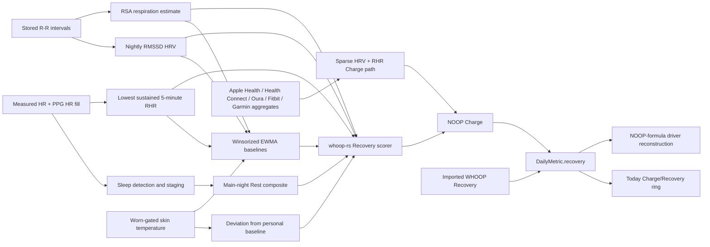

# Charge and Recovery: Algorithm and Data Audit

**Status:** Analysis complete. Correctness fixes and physiological validation remain outstanding.

**Scope:** Android-maintained NOOP path, with the `whoop-rs` scorer checked as the production formula. No iOS product work is proposed.

**Evidence snapshot:** NOOP working tree based on `f7238c427e2dd880675201acb845b184b880ff8d`; `whoop-rs` at `17c3a6f5f89a7330f4e1eecedcdd63cb2a34d39a`; inspected 2026-07-20. The NOOP tree was dirty. Relevant inspected dirty files were `WhoopBleClient.kt` (`sha256:8e6bca0ae6b3856e623d9bdd93ddd600986f8d943dd460dbae5a2e5aedf10cf3`), `TodayScreen.kt` (`sha256:7f9587a432bb4e98f31afe3cdc47b95ce5f04b2951bb2ba5f2442246c15b4763`), untracked `TodayHero.kt` (`sha256:0e1fd8e5696ab0ed29c0127929194eedf80897b0ea6d05060db35cd04efeb310`), and untracked `TodayRecovery.kt` (`sha256:e8f018320b6f4511bb9216626b32c4ce6e182fd28b659bb7be6bf2cf296dde15`). Base commits alone cannot reproduce claims involving those files; hashes anchor the exact inspected contents.

“Source-direct” means read directly from current code or tests. “Inferred” means a consequence of connected source-direct facts that has not been reproduced on hardware. “Modeled” means calculated from the formula with synthetic values. “Unknown” marks an unanswered device or validity question. None establishes medical or physiological validity.

## Executive conclusion

NOOP already has two different things under one `recovery` field:

1. Imported WHOOP Recovery, copied from an export.
2. NOOP Charge, computed locally from strap or daily-aggregate data.

NOOP Charge is a transparent personal-baseline composite. The Rust scorer combines HRV, resting HR, respiration, Rest quality, and skin-temperature deviation. Missing terms drop and remaining weights renormalize. The formula is deterministic and covered by in-memory Rust/Kotlin parity tests. The separate agreement fixture can skip when its local fixture is absent, so it is not guaranteed CI coverage.

Two source-direct correctness faults dominate the current implementation:

1. **Skin temperature is computed after Charge is scored.** The persisted row and “What shaped it” UI can show a skin-temperature contribution that did not affect the stored Charge number.
2. **All recently computed nights are rescored against one final baseline containing those same nights.** A day influences its own comparison point, and older days can be scored using later nights. This dampens deviations and makes past Charge values retrospectively mutable.

Further material gaps:

- Imported proprietary Recovery and locally computed Charge share one field, while the UI always reconstructs NOOP formula drivers. The explanation can therefore describe inputs that did not create the displayed score.
- Aggregate-only Charge scores from HRV and optional RHR, but its copied row can retain respiration, Rest, or skin fields. The UI can falsely present those retained fields as contributors.
- Documentation says real SpO2 can penalize Charge. No SpO2 input exists in the production scorer.
- Recovery Index and Activity Balance exist in Rust, FFI, and tests, but normal Android scoring never supplies them.
- Source-brand-era boundary detection exists and is tested, but no production caller uses it. Baselines can mix incompatible source eras.
- Stored R-R ordering can alter RMSSD, which drives the nominal 55% HRV term.

Current safe product description: **Charge is an approximate, offline wellness estimate relative to personal history. Imported WHOOP Recovery is a separate proprietary value displayed in the same slot.**

## System map



The final two arrows expose the main explainability problem: one displayed field can contain two algorithms, but the contributor view reconstructs only one.

## What the displayed number can mean

| Stored source | Value meaning | Inputs | Formula ownership |
|---|---|---|---|
| Imported WHOOP row | WHOOP Recovery percentage | Unknown proprietary pipeline | WHOOP |
| `"<deviceId>-noop"` raw-strap row | NOOP Charge | Raw-derived HRV/RHR/respiration, Rest, intended skin temperature | NOOP / `whoop-rs` |
| `"<deviceId>-noop"` aggregate row | Sparse NOOP Charge | Daily HRV and optional resting HR | NOOP / `whoop-rs` |

`WhoopRepository.mergeDaily` stores computed rows first, then field-coalesces imported rows over them. An imported non-null `recovery` wins. A null imported value is filled by computed Charge.

This makes the dashboard resilient to sparse imports, but the resulting `DailyMetric` no longer proves which algorithm created each individual field. The row's `deviceId` usually follows the imported row even when a null imported Recovery was filled by the computed sibling.

## Raw-strap Charge data path

1. `IntelligenceEngine.analyzeRecent` chooses one raw owner for each day.
2. It reads the broad night window containing HR, R-R, respiration, gravity, skin temperature, SpO2, and related streams.
3. `AnalyticsEngine.analyzeDay` detects all sleep sessions ending on that local day.
4. Main-night sleep supplies duration, stages, efficiency, disturbances, and Rest.
5. All matched sessions supply the recovery physiology:
   - resting HR: lowest per-session sustained five-minute floor;
   - HRV: duration-weighted whole-session RMSSD, or pooled deep-stage five-minute windows when enabled;
   - respiration: median per-session RSA estimate from R-R intervals;
   - skin temperature: worn-gated nightly mean.
6. Pass 1 scores using imported-only baselines where available and harvests new nightly values.
7. Pass 2 builds baselines from imported plus newly derived history, then rescoring writes `"<deviceId>-noop"` rows.
8. Imported daily values win field-by-field when the repository constructs the dashboard history.

The engine requires both nightly HRV and resting HR before entering the raw-strap scoring call. The Rust formula itself can score with HRV alone, and the aggregate path allows resting HR to be absent. Missing-RHR handling therefore differs by ingestion lane.

## Daily-aggregate Charge data path

`IntelligenceEngine.watchRecoveries` handles sources lacking raw R-R data. Current source candidates include the imported device row, Apple Health, Health Connect, Oura, Fitbit, and Garmin.

For each day:

1. Sort daily rows chronologically.
2. Build HRV and RHR baselines from strictly earlier rows.
3. Require today's HRV, a usable HRV baseline, and at least seven prior HRV readings.
4. Supply HRV and optional RHR to the same Rust scorer.
5. Drop respiration, Rest, and skin temperature; weights renormalize.
6. Store the result under the common computed source.

This lane correctly uses trailing history only. It is also lower-density and source-dependent. Comments describe daily HRV as “SDNN-ish” and assume personal z-scoring makes scale differences cancel. That assumption needs validation. Stable scaling can normalize units; it does not make SDNN and RMSSD physiologically interchangeable, nor protect a baseline from device/source transitions.

## Exact Charge formula

For a value `x`, EWMA baseline center `mu`, and EWMA absolute-deviation spread `s`:

```text
sigma ~= 1.253 * s
z(x) = (x - mu) / max(sigma, 1e-9)
```

Nominal terms:

| Driver | Term | Weight | Better direction |
|---|---:|---:|---|
| HRV | `z(HRV)` | 0.55 | Higher |
| Resting HR | `z(RHR baseline, current RHR)` | 0.20 | Lower |
| Respiration | `z(resp baseline, current resp)` | 0.05 | Lower |
| Rest quality | `(Rest/100 - 0.85) / 0.12` | 0.15 | Higher |
| Skin temperature | `-|deviation C| / 1.0` | 0.05 | Near baseline |
| Recovery Index, optional | `-overnight HR slope / 2.0` | 0.05 | Declining overnight HR |
| Activity Balance, optional | `z(Effort baseline, prior-day Effort)` | 0.05 | Lower prior-day load |

Only present terms enter the weighted mean:

```text
composite z = sum(term z * term weight) / sum(present weights)
Charge = clamp(100 / (1 + exp(-1.6 * (composite z + 0.20))), 0, 100)
```

Neutral inputs map to about `57.93`, not 50. Bands are red below 34, yellow from 34 through below 67, and green from 67.

Effective weights change with missing inputs:

| Available terms | Effective HRV share | Effective RHR share | Remaining share |
|---|---:|---:|---:|
| HRV + RHR + respiration + Rest + skin | 55.0% | 20.0% | 25.0% |
| Example raw path without respiration or skin | 61.1% | 22.2% | 16.7% Rest |
| Aggregate HRV + RHR only | 73.3% | 26.7% | 0% |
| Aggregate HRV only | 100% | 0% | 0% |

The `POPULATION_MEAN = 58` constant exists in Rust, but the production scorer does not use it as a fallback. An unusable HRV baseline or absence of every term returns null.

## Personal baselines

| Metric | Valid range | Spread floor | Center half-life | Spread half-life |
|---|---:|---:|---:|---:|
| HRV | 5–250 ms | 5 | 14 nights | 21 nights |
| Resting HR | 30–120 bpm | 2 | 14 nights | 21 nights |
| Respiration | 4–40/min | 0.5 | 14 nights | 21 nights |
| Skin temperature | 20–42 C | 0.3 | 14 nights | 21 nights |
| Effort | 0–100 | 5 | 14 nights | 21 nights |

Baseline lifecycle:

- First valid value seeds the center.
- Fewer than four valid nights: Calibrating and unusable.
- Four through thirteen valid nights: Provisional and usable.
- Fourteen or more: Trusted.
- More than fourteen missing nights after a usable baseline: Stale and unusable.
- First eight valid nights use a three-night center half-life, a 2.5x wider winsor clamp, and no hard-outlier rejection.
- Settled values beyond five spreads are seen but not folded.
- Accepted values are clamped to three spreads before updating the center.
- Manual Charge recalibration writes separate HRV and recovery-wide epochs, dropping earlier history during engine folds.

`deviceEraEpoch` detects changes between coarse source brands and has direct unit tests. It distinguishes identified Oura, Fitbit, and Garmin IDs. It deliberately groups WHOOP 4, WHOOP 5, Apple Health, Health Connect, and unknown IDs into the `whoop` bucket. No production caller was located. Manual recalibration therefore works, while this limited automatic cross-brand separation does not.

## Confirmed strengths

| Confidence | Finding |
|---|---|
| Source-direct | Formula is deterministic, inspectable, offline, and explicitly approximate. |
| Source-direct | Rust is the production scorer; Kotlin constants and trace helpers retain explainability. |
| Source-direct | Missing optional terms renormalize instead of inserting fabricated values. |
| Source-direct | Cold start returns null until the HRV baseline becomes usable. |
| Source-direct | Baselines validate bounds, adapt quickly during early life, winsorize ordinary extremes, and reject settled hard outliers. |
| Source-direct | Imported WHOOP Recovery is preserved rather than overwritten. |
| Source-direct | Aggregate-only scoring uses strictly prior history for each day. |
| Source-direct | User recalibration epochs reach the engine baseline folds. |
| Source-direct | The dashboard can carry the last scored recovery into an unscored current day and labels that state. |
| Source-direct | Formula parity tests cover Rust/Kotlin agreement and independent local formula replication. |

Parity proves internal consistency. It does not prove external agreement, physiological validity, or suitable calibration across generations and sources.

## What is wrong

### 1. Skin temperature is displayed but not scored

Pass 2 currently runs in this order:

```text
daily = sleepEditedDaily(pass1Daily, ...)
recovery = recomputeRecovery(daily, baselines2)
trace = recoveryTraceLines(daily, baselines2)
skinTempDevC = recomputeSkinTempDev(nightlySkinTemp, baselines2.skinTemp)
persist daily.copy(recovery = recovery, skinTempDevC = skinTempDevC)
```

For a BLE-only pass, `pass1Daily.skinTempDevC` is null because pass 1 has no newly seeded skin baseline. Pass 2 computes Charge before attaching the newly available deviation. Therefore:

- stored Charge omits skin temperature;
- the recovery trace omits skin temperature;
- the persisted row still carries the new skin deviation;
- Today later rebuilds contributors from the persisted row and can claim skin temperature moved Charge.

This is a source-direct correctness and explainability defect. Existing skin-temperature tests validate collection, baseline gating, and formula behavior, but no located end-to-end test proves the persisted Charge changes when only the nightly skin deviation changes.

### 2. Raw-strap rescoring leaks current and future nights into baselines

Pass 2 builds one `baselines2` from the complete imported-plus-recent set. It then loops over every recently scored night and recomputes each day against that same final baseline.

Consequences:

- today's value contributes to today's baseline before being z-scored;
- the baseline moves toward the current value and can dampen its deviation;
- an older day can be scored against nights that occurred after it;
- rescanning after another night can change previously stored Charge values;
- the raw-strap path disagrees methodologically with `watchRecoveries`, which uses only earlier rows.

This is source-direct code behavior. The exact score impact depends on history and is unmeasured. Correct policy should be defined before patching: immutable morning-as-known scores, or intentionally retrospective scores. Current code and product wording imply the former.

### 3. Imported Recovery can receive a false NOOP explanation

Imported non-null Recovery wins the merged `recovery` field. `recoveryChargeDrivers`, however, always folds the visible merged history and runs NOOP's driver formula. It does not branch on score provenance.

For an imported WHOOP winner, “What shaped it” does not describe the displayed proprietary score. It describes a counterfactual NOOP score using nearby visible fields.

Even for computed Charge, reconstruction can diverge because the UI:

- folds the entire merged history;
- includes the displayed day in its own baseline;
- does not apply manual recalibration epochs;
- does not preserve original raw-owner or source-era boundaries;
- reads the persisted skin deviation that the current pass-2 order failed to score.

The UI comments saying the bars match the ring's inputs are therefore not a reliable invariant.

### 4. Aggregate-only Charge can receive a false full-driver explanation

`WatchRecovery` scores daily-aggregate rows using HRV and optional resting HR only. The caller then creates the computed row with `row.copy(deviceId = computedId, recovery = recovery)`, preserving any respiration, sleep-quality, or skin-temperature fields already present on that row.

`recoveryChargeDrivers` later sees those preserved fields and includes them in its reconstructed formula. A locally computed aggregate Charge can therefore show additional “What shaped it” terms that were explicitly dropped during scoring.

This differs from the imported-WHOOP mismatch: the headline is locally computed, but its explanation still uses a wider input set than the scorer did. Provenance must include scoring lane and actual term presence, not only imported-versus-computed status.

### 5. SpO2 documentation contradicts production

`docs/ANALYTICS.md` says real imported SpO2 applies a small penalty below about 95%. The Rust `RecoveryInput`, Android FFI call, raw-strap scorer, and aggregate scorer contain no SpO2 parameter.

SpO2 is collected and displayed, including WHOOP 5/MG sleep percentage data, but it does not affect Charge. Documentation must be corrected unless a separately reviewed algorithm is intentionally added.

### 6. Recovery Index and Activity Balance are dormant

Rust supports overnight HR-decline slope and prior-day Effort terms. FFI exposes them and tests exercise them. Normal `AnalyticsEngine` and `IntelligenceEngine.recomputeRecovery` calls leave both null.

`Baselines.strainCfg` is documented as backing Activity Balance, but normal production does not build or pass the needed Effort baseline. These are library capabilities, not current Charge inputs. Product or developer documentation must not describe them as active.

### 7. Source-brand eras can be mixed

`Baselines.deviceEraEpoch` identifies transitions involving recognized Oura, Fitbit, or Garmin source IDs and has extensive tests. No production use was found. It intentionally does not split WHOOP generations, Apple Health, Health Connect, or unknown IDs. HRV history can therefore cross recognized wearable brands without the available boundary being applied, while other transitions remain outside the helper's detection contract.

Personal z-scoring does not solve abrupt distribution changes. This is especially risky where one source reports RMSSD-like values and another provides SDNN-like aggregates.

### 8. Stored R-R ordering can bias HRV

Room returns R-R rows ordered by `ts`, then `rrMs`, then `seq`. Insertion assigns `seq`, but distinct intervals sharing one coarse timestamp are sorted numerically before sequence. RMSSD depends on successive interval order.

HRV has the largest nominal weight. The same R-R stream also estimates respiration. One ordering or coverage problem can therefore move two nominally separate Charge terms in a correlated direction.

This is an inferred score risk from source-direct ordering behavior. A captured night with equal-second, distinct R-R values is required to quantify it.

### 9. Missing-RHR policy differs by lane

Raw-strap scoring returns null unless both HRV and resting HR exist. Rust supports missing RHR, and daily-aggregate scoring drops it and renormalizes.

A usable raw-derived HRV night can therefore remain blank solely because resting HR was unavailable, while a lower-density import can score from HRV alone. The desired honesty policy is undefined and needs one cross-lane contract.

### 10. Physiology and Rest use different sleep-session sets

Rest uses the selected main-night group. HRV uses all matched sessions with duration weighting. RHR uses the lowest value across all matched sessions. Respiration takes the median across all matched sessions.

A nap can therefore affect recovery physiology while the sleep-quality term describes only the main night. A single unusually low five-minute nap segment can become the day's RHR. This behavior is intentional in comments but has no located outcome validation.

### 11. Confidence describes baseline maturity only

Charge confidence reads score presence and the HRV baseline state:

- no score or unusable baseline: Calibrating;
- usable but not Trusted: Building;
- Trusted at fourteen or more nights: Solid.

Although a seven-night threshold exists, the `!trusted` condition means nights 4–13 remain Building. Confidence ignores:

- R-R amount and coverage;
- stored interval ordering quality;
- measured-versus-PPG HR coverage;
- missing respiration, Rest, skin temperature, or RHR;
- sleep-stage confidence;
- raw strap versus daily aggregate source;
- imported proprietary versus computed score.

Today reconstructs confidence from merged history without recalibration epochs. An imported Recovery can therefore receive a NOOP baseline-maturity label unrelated to its actual source confidence.

### 12. Computed aggregate provenance collapses

Multiple daily sources can generate sparse Charge, but results are written under one computed ID. Earlier source priority can preclaim a day. The final row does not retain which aggregate source supplied HRV/RHR.

This limits debugging, source-switch detection, and honest explanation. Field-level provenance should be persisted or resolvable before expanding cross-source scoring.

## WHOOP 5 and MG risk

### Highest risk: history clock and offload completeness

Charge depends on historical night data. Live heart rate continuing to work does not prove Charge inputs are intact. A generation-specific history clock or cursor error can remove or misplace R-R and sleep windows while the live UI still looks connected.

The separate clock audit found that WHOOP 5/MG clock correlation remains a hardware-validation area. Until captured offloads prove timestamps, ordering, resume behavior, and reboots, missing Charge must be diagnosed at the raw history layer before tuning the formula.

### R-R quality dominates

HRV carries 55% nominal weight and up to 73.3% on the two-term aggregate path. WHOOP 5/MG PPG-derived HR can fill HR and help sleep/RHR analysis, but it cannot replace beat-to-beat R-R for RMSSD.

Respiration is also derived from R-R. Sparse, reordered, or truncated intervals can therefore suppress both HRV and respiration. The scorer treats the two as separate terms even though their errors can share one source.

### Sensor semantics differ by generation

- WHOOP 5/MG respiration is an R-R-derived RSA estimate, not a confirmed direct respiratory channel.
- WHOOP 5/MG sleep SpO2 percentage is stored but does not feed Charge.
- Gen5-family skin temperature is interpreted as direct centidegrees.
- WHOOP 4 skin temperature uses a per-device raw anchor and is more approximate.

The current skin-order defect prevents the new deviation affecting stored Charge, but the UI can still present it as a contributor. Fixing that defect will expose generation-specific skin calibration risk that is currently masked.

### WHOOP 5 and MG must be tested separately

Shared framing does not prove identical R-R density, skin-temperature availability, SpO2 coverage, sleep-history behavior, or restart semantics. Validation must stratify WHOOP 5 and MG rather than pooling them.

## What must be researched

### Priority 0: correctness fixtures

1. Add an end-to-end pass-2 test where only skin-temperature deviation changes. Prove persisted Charge and contributor trace change together.
2. Add a chronological baseline fixture proving day `D` uses only nights before `D`.
3. Prove rescoring with a new future night does not change historical Charge, unless retrospective scoring becomes an explicit product decision.
4. Add provenance tests ensuring imported WHOOP Recovery never shows NOOP-computed contributors as actual causes.
5. Add an aggregate-only fixture proving its explanation includes exactly the HRV/RHR terms supplied to `WatchRecovery`.
6. Pin recalibration behavior through engine score, UI drivers, calibration count, and confidence.

### Priority 1: captured WHOOP 5/MG data integrity

For each generation, capture multiple full nights containing:

- raw history anchor and wall-clock correlation;
- history cursor and resume points;
- R-R count, coarse timestamp collisions, sequence, and gaps;
- measured and PPG-derived HR coverage;
- detected session boundaries and stages;
- whole-night and deep-window RMSSD;
- RSA respiration result;
- skin-temperature sample count and nightly mean;
- SpO2 percentage coverage;
- final term z-scores, weights, baseline state, and Charge.

Repeat after app restart, phone reboot, strap reboot, interrupted offload, and resumed offload. Compare duplicate and missing records before interpreting physiological results.

### Priority 2: source and method validation

Build a per-day comparison table with source-direct inputs:

| Day | Device/source | NOOP Charge | Imported Recovery | HRV method | R-R coverage | RHR floor | Rest | Resp | Skin dev | Baseline nights |
|---|---|---:|---:|---|---:|---:|---:|---:|---:|---:|

Then evaluate:

- whole-night versus deep-stage RMSSD;
- RMSSD versus imported daily HRV/SDNN-like values;
- main-night-only versus all-session physiology;
- RHR floor versus overnight median/mean;
- raw-strictly-prior versus current shared-baseline scoring;
- NOOP Charge agreement with imported WHOOP Recovery as a reference, not a target;
- score stability under source/device changes.

Use median absolute error, signed bias, rank correlation, band agreement, missing-day rate, and within-person day-to-day direction. Stratify by device generation and input completeness.

### Priority 3: product semantics

Decide and document:

- whether imported WHOOP Recovery and NOOP Charge remain one UI metric;
- whether historical Charge is immutable morning-as-known or retrospectively recalculated;
- whether a raw night may score from HRV without RHR;
- whether naps belong in recovery physiology;
- whether Recovery Index and Activity Balance should ship or be removed from exposed API/docs;
- whether SpO2 remains display-only;
- what “Solid” means beyond baseline age;
- how carried prior-day Charge is labeled everywhere.

## Recommended implementation order

1. Add the failing pass-2 skin-temperature test and correct input assembly behind a rollout gate. Do not release the newly active term yet.
2. Validate skin-temperature units and nightly deviations separately on WHOOP 4, WHOOP 5, and MG.
3. Enable corrected skin scoring only for validated families; retain the gate where fixtures remain absent.
4. Change raw-strap rescoring to chronological, strictly prior baselines: score day `D` from state through `D-1`, then fold day `D`. Update cold-start expectations so four prior valid nights make the fifth night the first scorable one.
5. Persist or resolve score provenance. Hide or label NOOP contributors for imported Recovery and aggregate-only Charge.
6. Make UI drivers and confidence consume the exact engine baseline snapshot or persisted trace, including recalibration epochs.
7. Correct SpO2 and dormant-term documentation.
8. Wire source-brand-era boundaries before relying on mixed aggregate sources.
9. Preserve true R-R sequence through storage and validate captured same-second collisions.
10. Collect WHOOP 5 and MG fixtures before changing formula constants or adding other terms.

Do not tune weights while data order, chronology, and provenance remain wrong. Formula calibration against corrupted or ambiguously sourced inputs will encode those defects.

## Required tests

| Test | Missing protection |
|---|---|
| Pass-2 skin deviation changes stored Charge | Current ordering defect |
| Stored Charge trace equals persisted contributor inputs | UI/engine divergence |
| Day uses only earlier baseline rows | Self/future leakage |
| Adding tomorrow does not change yesterday | Historical mutability |
| Imported Recovery suppresses or labels NOOP contributors | False explanation |
| Aggregate-only explanation includes only supplied HRV/RHR terms | False explanation |
| UI driver/confidence folds honor recalibration epochs | Post-recalibration mismatch |
| Source-brand switch activates era boundary | Mixed distributions |
| Same-second distinct R-R intervals preserve physiological sequence | RMSSD bias |
| Raw path missing-RHR contract | Cross-lane inconsistency |
| Main-night versus nap sensitivity fixture | Session-selection ambiguity |
| Confidence responds to input completeness and source | Misleading Solid tier |
| SpO2 has no score effect unless explicitly implemented | Documentation contract |
| Recovery Index and Activity Balance production wiring | Dormant feature ambiguity |

Existing `RustRecoveryParityTest`, `RecoveryAgreementTest`, and Rust unit tests remain valuable. They prove formula agreement. `RecoveryAgreementTest` explicitly uses a local independent replication, not an external physiological gold standard.

## Acceptance criteria

Charge/Recovery becomes defensible when:

1. Every displayed computed contributor is proven to have affected the stored number.
2. Every day uses a documented chronological baseline policy.
3. Imported and computed scores retain visible, field-level provenance.
4. UI explanation and confidence use the same inputs and baseline state as scoring.
5. R-R storage preserves input order needed by RMSSD.
6. Source-brand changes cannot silently mix incompatible HRV eras.
7. WHOOP 5 and MG each have restart/offload fixtures with raw-to-score traces.
8. Skin-temperature scoring is enabled only for device families with validated units and deviation fixtures.
9. Documentation lists only active production terms.
10. Algorithm comparisons remain wellness validation, never medical claims.

## Evidence map

| Concern | Primary source |
|---|---|
| Formula and optional terms | `../whoop-rs/crates/physio-algo/src/recovery.rs` |
| Kotlin-to-Rust call shape | `android/app/src/main/java/com/noop/analytics/RustScores.kt` |
| Baseline lifecycle and source-brand-era helper | `android/app/src/main/java/com/noop/analytics/Baselines.kt` |
| Nightly HRV/RHR/respiration/skin derivation | `android/app/src/main/java/com/noop/analytics/AnalyticsEngine.kt` |
| Two-pass scoring, shared baseline, skin ordering | `android/app/src/main/java/com/noop/analytics/IntelligenceEngine.kt` |
| Aggregate-only scoring | `android/app/src/main/java/com/noop/analytics/WatchRecovery.kt` |
| Imported-over-computed field merge | `android/app/src/main/java/com/noop/data/WhoopRepository.kt` |
| R-R persistence ordering | `android/app/src/main/java/com/noop/data/WhoopDao.kt`, `WhoopRepository.kt` |
| Today contributors and confidence | `android/app/src/main/java/com/noop/ui/TodayRecovery.kt` |
| Confidence thresholds | `android/app/src/main/java/com/noop/analytics/ScoreConfidence.kt` |
| Current algorithm claims | `docs/ANALYTICS.md` |
| Formula parity and local agreement | `RustRecoveryParityTest.kt`, `RecoveryAgreementTest.kt`, `RecoveryIndexActivityBalanceTest.kt` |
| Generation clock risk | `docs/superpowers/reports/2026-07-20-whoop5-clock-gap-research.md` |
