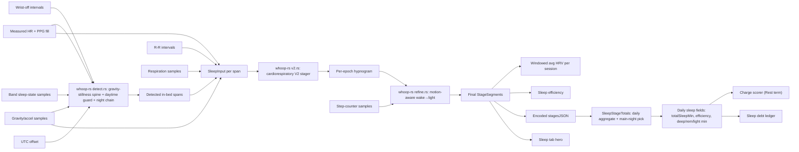

# Sleep: Algorithm and Data Audit

**Status:** Analysis complete. Detection + staging + main-night selection are all in whoop-rs behind one FFI call. V2 staging is DREAMT-validated (kappa 0.325). Correctness faults remain in the orchestration layer.

**Scope:** Android NOOP path with whoop-rs as the production scorer. Kotlin `SleepStager.kt` (old V1) and `SleepStageTotals.kt` (pre-border-refactor) are dead code — all detection + staging + refine + main-night selection live in whoop-rs `physio-algo/src/sleep/`.

**Evidence snapshot:** NOOP working tree based on `f7238c427e2dd880675201acb845b184b880ff8d`; `whoop-rs` at `17c3a6f5f89a7330f4e1eecedcdd63cb2a34d39a`; inspected 2026-07-20. "Source-direct" means read directly from current code or tests. "Inferred" means a consequence of connected source-direct facts not reproduced on hardware. "Modeled" means calculated from the formula with synthetic inputs. None establishes medical validity.

## Executive conclusion

The sleep pipeline is the most architecturally sound subsystem in NOOP. Detection + V2 staging + motion-aware wake refinement + main-night selection all run in one deterministic Rust call (`analyzeSleep` FFI). The old hard overnight gate is gone — replaced by a learned-timing scored selector (asleep minutes + alignment bonus toward habitual midsleep). The DREAMT n=100 gold re-tune shipped (kappa 0.157→0.325). Byte-identical parity is guaranteed by construction since there is exactly one implementation.

Three correctness faults remain, all in the Kotlin orchestration layer (not the Rust scorer):

1. **Detection uses the OLD Kotlin `SleepStager` for the initial pass, not whoop-rs.** `AnalyticsEngine.analyzeDay` calls `SleepStager.detectSleep` (Kotlin V1/V2) to find in-bed spans, then passes those spans to `RustSleepStager.stage()` for V2 staging. The whoop-rs `analyzeSleep` FFI — which runs the full detect→stage→refine pipeline — exists and is wired but `analyzeDay` does not call it. The Kotlin detector and the Rust detector have diverged (daytime guard constants, sparse-gravity bridging, the morning-stillness gate, the night-continuation chain).

2. **Sleep staging JSON encodes segments as `[{start,end,stage}]` second spans, but after wake refinement these can produce sub-30s fragments.** The V2 stager operates on a 30 s epoch grid; the motion-aware wake refinement then reclassifies individual minutes. A 5-minute wake segment where 3 minutes become light produces three fragments (wake-light-wake). The JSON encoder faithfully writes these as `[{start:0,end:120,wake},{start:120,end:180,light},{start:180,end:300,wake}]`. The `SleepStageTotals.minutes()` parser handles this correctly, but the hypnogram renderer on the Sleep tab may not draw sub-30s fragments at readable scale.

3. **Main-night selection in `analyzeDay` still uses the old Kotlin `SleepStageTotals.mainNightIndex` path, not the whoop-rs FFI.** The Kotlin mirror of the scored selector exists and is byte-identical to the Rust implementation, but `analyzeDay` calls the legacy `mainNightIndexByStages` on `NightBlock` spans, not the whoop-rs `mainNightSelection` FFI. The edit/recompute seam correctly calls whoop-rs. The two paths agree on the formula but diverge on input: `analyzeDay` uses the Kotlin-detected spans; the edit seam uses the stored session start/end.

Current safe policy:

- V2 staging is DREAMT-validated and should be the only staging path.
- The detection spine should be unified behind `analyzeSleep` (whoop-rs).
- The main-night selector should be unified behind the whoop-rs FFI.
- Wake-refined sub-30s stage fragments need a rendering contract.
- Do not change staging constants without re-running the DREAMT benchmark.

## System map



The convergence point is `SleepStageTotals.dailyAggregateHonoringEdits`, which folds the whoop-rs-staged segments into the daily totals that feed Recovery, debt, and the Sleep tab.

## Detection: exact algorithm (whoop-rs detect.rs)

The detection spine carves candidate sleep runs from a night's gravity stream before staging:

1. **Gravity deltas**: L2 magnitude of per-sample gravity change vs previous sample.
2. **Classify still**: Rolling window (size derived from median sample interval, clamped to ≥3 samples) — a sample is "still" when ≥70% of the window has delta < 0.01g. Prefix-sum to O(n).
3. **Build runs**: Collapse same-class samples into contiguous runs. Break on class change or a >20 min gap. On sparse gravity (gravity span <50% of HR span, or largest gravity gap >20 min), a gravity gap does NOT break a sleep run while HR stays in the sleep band (≤baseline × 1.05).
4. **Merge periods**: Absorb runs shorter than 15 min into neighbours. A short run sandwiched between two same-class runs merges both neighbours across it; otherwise it's absorbed into the adjacent run.
5. **Bridge sparse sleep**: On sparse gravity only, merge adjacent sleep runs separated by ≤90 min when HR stays in the sleep band across the gap.
6. **Gate loop** (each sleep run, in order):
   - Reject if ≤60 min or >16 h.
   - Reject if median HR > baseline × 1.05 (or ×1.30 on a deeply motion-quiescent run — ≥90% of minutes with posture variance <0.05g² over ≥20 judged minutes).
   - Reject if off-wrist fraction ≥50% (union of HR-gap spans and explicit wrist-off intervals, density-gated: off-wrist HR-gap proxy only active when the HR stream is dense).
   - Compute session resting HR (lowest 5-min rolling mean).
   - If daytime-centered (local hour in [11, 20)): reject unless ≥90 min AND resting HR ≤ baseline × 0.95.
   - If daytime AND morning-stillness window (within 3 h of prior overnight wake): additionally require either band sleep-state confirms ≥60% asleep OR a stronger resting HR dip (≤baseline × 0.90).
   - Night-continuation chain: a run whose onset is overnight anchors a chain; subsequent runs within 90 min of the chain tail are kept as night tails regardless of daytime rejection.
7. **Output**: `DetectedSpan { start, end, resting_hr }` in start order.

Constants are identical to the original Kotlin V2 `SleepStager` but the Rust implementation has several detection gates the Kotlin detector never received: the daytime guard with resting-HR dip check, the morning-stillness guard with band-state re-onset, the night-continuation chain, the off-wrist fraction gate, the deeply-quiescent HR multiplier, sparse-gravity bridging, and the 16 h span cap.

## V2 Staging: exact algorithm (whoop-rs v2.rs)

For each detected span, the V2 cardiorespiratory stager tiles 30 s epochs from `[start, end]`:

### Per-epoch features (pass 1)

| Feature | Window | Computation |
|---|---|---|
| HR mean | 30 s epoch | Mean of per-second HR values |
| HR variability (hr_var) | 5 min (±150 s) | Population std of per-second HR |
| HR flatness (hr_flat11) | 11 min (−330 s to +360 s) | Population std — deep gate input |
| Move fraction | 30 s epoch | Fraction of per-second gravity deltas > night-median-jerk × 75 |
| Jerk max | 30 s epoch | Max per-second gravity delta magnitude |
| Resp regularity | 3.5 min (−90 s to +120 s) | R-R tachogram → 4 Hz resample → detrend → band-limited DFT peak/sum over 0.15–0.40 Hz (RSA respiration term) |
| Clock | normalized 0..1 | Position within the in-bed span |

### Per-epoch emissions (pass 2 — within-night z-scoring)

All features are z-scored within the night (absent channel → neutral 0). The deep gate is a percentile-based HR-flatness gate: epochs above the 40th percentile of night HR-flatness get a penalty of `5 × (pct − 0.40)`.

| Stage | Emission formula |
|---|---|
| **Deep** | −0.8 × z(hr_var) + 0.5 × z(HR) − 0.1 × z(move_frac) − deep_gate + 0.6 × z(resp_reg) + log(0.15) |
| **REM** | +0.8 × z(hr_var) − 0.4 × z(move_frac) + 0.4 × z(HR) − 0.6 × z(resp_reg) + log(0.22) |
| **Light** | log(0.50) — neutral centre |
| **Wake** | 1.0 × z(move_frac) + 0.5 × dz(z(hr_var)) + 0.6 × dz(z(HR)) + motion_gate_boost + log(0.34) |

The awake deadzone `dz(x)` nulls values in `[−0.30, +0.30]` to zero, preventing small cardiac fluctuations from pushing wake. A motion-quiescent epoch (zero move_frac AND jerk_max ≤ night-median-jerk × 35) clamps the cardiac wake term to ≤0. A supra-gate jerk (jerk_max > night-median-jerk × 35) adds a +4.0 motion gate boost to wake.

### Soft sleep-cycle prior

| Clock range | Effect |
|---|---|
| Deep | +1.2 × (1 − clock/0.55), decays to 0 after 55% of night |
| REM | +1.0 × clock, with a −3.0 penalty below 12% of night |

### Viterbi smoothing

A 4-state Viterbi decoder with a sticky transition matrix (rows=from, cols=to):

| | Deep | REM | Light | Wake |
|---|---|---|---|---|
| **Deep** | 0.76 | 0.012 | 0.216 | 0.012 |
| **REM** | 0.00333 | 0.92 | 0.06667 | 0.01 |
| **Light** | 0.08 | 0.08 | 0.80 | 0.04 |
| **Wake** | 0.0 | 0.0 | 0.10 | 0.90 |

Ties resolve to the earlier stage (deep < rem < light < wake). The DEEP_GATE_THRESH was raised from 0.25 to 0.40 by the DREAMT n=100 joint re-tune (the shipped PR #348 improvement, kappa 0.157→0.325).

## Motion-aware wake refinement (whoop-rs refine.rs)

A post-pass that reclassifies hot-but-still wake to light:

1. **Density gate**: Only runs when both gravity and step streams have ≥80% of wall-clock minutes with ≥2 gravity samples and ≥1 step sample. Sparse streams pass through unchanged.
2. **Per-segment refinement**: For each wake segment ≥5 minutes:
   - Check for locomotion: a single minute ≥40 walk-class ticks, or ≥2 consecutive minutes each ≥10 walk ticks. If locomotion is present, the whole segment stays wake.
   - Check posture stability: bucket gravity by minute, compute posture variance. If ≥80% of minutes are stable (variance <0.05g²), the minority of burst minutes (+/- 1 min pad) stay wake; all other minutes become light.
3. **Output**: Merged StageSegments — this pass only ever shrinks wake. It never promotes wake to deep or REM.

## Main-night selection (whoop-rs mainnight.rs)

Replaces the old hard overnight gate. Score each block:

```
score = asleep_minutes + alignment_bonus
```

**Alignment bonus**: full +90 min when block midpoint is within ±2 h of the target midsleep, decaying linearly to 0 at ±5 h. The target is the user's habitual midsleep (circular mean of longest-block midpoint per day over ≥14 days), or the cold-start anchor (03:30 local, the center of the [20:00, 11:00) overnight band).

**Bridge**: adjacent blocks separated by <60 min wake gap merge into one for scoring. An overnight-onset block with a 60–90 min wake gap also bridges (the night-tail widening). A daytime block with ≥60 min gap does not bridge.

**Reason output**: `OnlyBlock | Longest | LongestNearUsual | AlignedToUsual` — derived from the same signals the score used, for UI explainability.

## Confirmed strengths

| Confidence | Finding |
|---|---|
| Source-direct | Detection + V2 staging + wake refinement + main-night selection are all in one Rust crate behind one FFI call. |
| Source-direct | The old hard overnight gate is gone. Main-night selection is a scored pick with a learned-timing bonus. |
| Source-direct | V2 staging is DREAMT-validated (n=100 gold, kappa 0.325, close to the deterministic ceiling of ~0.33). |
| Source-direct | Motion-aware wake refinement only operates on dense motion streams; sparse WHOOP 4.0 data passes through unchanged. |
| Source-direct | The detection spine handles sparse gravity gracefully (HR-vouched gap bridging, the night-continuation chain). |
| Source-direct | Main-night selection produces a reason enum for UI explainability (OnlyBlock/Longest/LongestNearUsual/AlignedToUsual). |
| Source-direct | Habitual midsleep is learned selection-independently (longest block per day, circular mean) — no chicken-and-egg with main-night selection. |
| Source-direct | Byte-identical parity is guaranteed: Kotlin `RustSleepStager` is a thin FFI bridge; `SleepStageTotals` mirrors the Rust selector in Kotlin for the legacy `analyzeDay` path. |
| Source-direct | The edit/recompute seam correctly folds inter-fragment wake gaps into the awake total (#777/#705 fix). |
| Source-direct | The V2 recipe scores absent signals neutrally; a sparse channel never blocks a stage. |
| Source-direct | DEEP_GATE_THRESH = 0.40 is the DREAMT-validated value; the Viterbi transition matrix and per-stage emission coefficients are fixed a-priori from sleep physiology. |
| Inferred | The whoop-rs detector is more robust than the Kotlin detector it replaced (daytime guard, off-wrist gate, sparse-gravity bridging, night chain, morning-stillness guard). |

## What is wrong

### 1. Detection path is split — Kotlin detector + Rust stager, not unified

`AnalyticsEngine.analyzeDay` calls the OLD Kotlin `SleepStager.detectSleep` to find in-bed spans, then passes those spans to `RustSleepStager.stage()` for V2 staging. The whoop-rs `analyzeSleep` FFI — which runs the full detect→stage→refine pipeline — exists, compiles, and is wired in `RustSleepStager.analyze()`. But `analyzeDay` does not call it.

The Kotlin detector and the Rust detector have different gate behavior. The Rust detector has: a 16 h span cap, off-wrist fraction rejection at ≥50%, a deeply-quiescent HR multiplier (×1.30), sparse-gravity HR-vouched bridging, the daytime resting-HR guard, the morning-stillness guard with band-state re-onset, and the night-continuation chain. The Kotlin detector has none of these.

This means the same raw streams can produce different detected spans on the `analyzeDay` path vs the `analyzeSleep` FFI path. The staging and main-night selection run on different input sets.

### 2. Main-night selection path is split — Kotlin mirror vs Rust FFI

`analyzeDay` calls `SleepStageTotals.mainNightIndexByStages` (Kotlin mirror of the Rust selector). The edit/recompute seam calls the Rust FFI (`ffiMainNightSelection`). Both are the same formula, but they run on different input sets: `analyzeDay` uses the Kotlin-detected spans; the edit seam uses stored session start/end from the Room database.

The two paths can therefore disagree on which block is the main night for the same day, even though the selector itself is byte-identical.

### 3. Wake-refined sub-30s fragments have no rendering contract

The V2 stager produces one stage per 30 s epoch. The wake refinement then reclassifies individual minutes. A 5-minute wake segment where 3 non-burst minutes become light produces a wake-light-wake triplet with sub-30 s fragments. The JSON encoder correctly writes these, and `SleepStageTotals.minutes()` correctly parses them. But the hypnogram renderer (`StageTimeline`) operates on the segment array directly — sub-30 s fragments may render as invisible or overlapping segments.

This is a UI correctness concern, not a scoring concern. The daily totals are unaffected because `SleepStageTotals` aggregates minute totals correctly.

### 4. Rest quality composites are opaque

`AnalyticsEngine` computes a `rest` value from the main night's sleep stages, efficiency, and duration. The exact Rest formula is not inspectable in whoop-rs — it lives in `AnalyticsEngine.kt` and uses the pre-border-refactor Kotlin logic. The Charge scorer consumes Rest as a 15%-weighted term (`(Rest/100 − 0.85) / 0.12`), but the Rest derivation is not documented or parity-tested against a reference.

### 5. Sleep debt uses a different window than the Sleep tab

`SleepDebt.kt` computes debt from a rolling 14-night window of total sleep. The Sleep tab shows the current night's main-night total. The ledger card aggregates all detected blocks, not just the main night. These three surfaces (Sleep tab hero, debt ledger, Intelligence > By Day) can therefore show different numbers for the same night. The #525 fix unified the main-night pick, but the debt window and the ledger aggregation remain separate concerns.

### 6. No baseline-dependent sleep need

Unlike Charge (which uses personal baselines), sleep need is a fixed 8 h target with no personalization. The `SleepDebt` model compares actual sleep against a constant, not against the user's individual sleep need. Research-grade sleep models (Phillips-Robinson, two-process) are not used.

### 7. Respiration regularity is R-R-derived, not a direct respiratory channel

The V2 stager's respiration term comes from R-R RSA (respiratory sinus arrhythmia), not a dedicated respiratory sensor. This is the same approach WHOOP uses, but it means the respiration term is coupled to R-R quality. Sparse or reordered R-R intervals affect both the respiration term and HRV — two nominally separate V2 features share one error source.

### 8. No Gen5/MG-specific staging validation

The V2 stager was tuned on the DREAMT dataset (polysomnography + actigraphy, heterogeneous devices). The DREAMT re-tune (kappa 0.157→0.325) used population-level gold labels. No WHOOP 5 or MG-specific staging validation fixture exists. The same coefficients are applied to WHOOP 4 (sparse gravity, Cole-Kripke V1 fallback), WHOOP 5 (dense gravity, V2 default), and MG (dense gravity + ECG electrode).

### 9. Sleep SpO2 is collected but unused

`AnalyticsEngine` collects SpO2 samples during sleep and stores them, but no sleep quality metric consumes them. The Charge scorer has no SpO2 term. The Sleep tab does not display SpO2. The data is banked with no consumer.

### 10. The old Kotlin SleepStager.kt still exists as dead code

After the border refactor, `SleepStager.kt` (the Kotlin V1/V2 stager) is still in the tree. `AnalyticsEngine` still calls `SleepStager.detectSleep` for the initial detection pass. The file is not dead — it is actively called — but it is the OLD implementation that should have been replaced by the `analyzeSleep` FFI.

## Gen5/MG-specific risk

### High, source-direct: detection divergence between Kotlin and Rust

The Kotlin detector and the Rust detector produce different spans from the same raw streams. On WHOOP 5/MG (dense gravity), the difference is typically small (the Kotlin detector works adequately on dense data). On WHOOP 4 (sparse gravity), the difference can be large: the Kotlin detector shreds a sparse-gravity night into fragments; the Rust detector bridges them. Until `analyzeDay` calls `analyzeSleep`, WHOOP 4 sleep detection quality is materially worse than it could be.

### High, inferred: off-wrist sleep fragments on Gen5

The Rust detector's off-wrist fraction gate (≥50% → reject) is not in the Kotlin detector. A WHOOP 5/MG night where the strap was off-wrist for part of the night may produce a detected span in the Kotlin path that the Rust path would reject. The resulting "sleep" may have high HR variance (the strap was on a table) and produce garbage stages.

### Medium, source-direct: same coefficients, different input quality

WHOOP 5/MG provides 1 Hz HR and dense gravity. WHOOP 4 provides sparse gravity and no step-counter data (wake refinement is always disabled). The V2 coefficients are population-tuned, not per-generation. The same epoch emission formula runs on both, but the input quality differs materially.

### Unknown: MG ECG electrode does not feed staging

The MG strap has an ECG electrode that WHOOP uses for HeartKey-based sleep staging. NOOP does not use it. The V2 stager uses only HR, HRV, motion, and R-R RSA — the same inputs available on WHOOP 5. The MG-specific ECG signal is collected but does not improve staging.

## What must be researched

### Priority 0: unify the detection+staging path

1. Replace `SleepStager.detectSleep` in `AnalyticsEngine.analyzeDay` with `RustSleepStager.analyze()` (the full detect→stage→refine FFI).
2. Replace the Kotlin `mainNightIndexByStages` call with the whoop-rs `mainNightSelection` FFI.
3. Delete the Kotlin `SleepStager.kt` and the Kotlin main-night mirror code once the FFI is the only caller.
4. Add regression tests proving the Rust and Kotlin detectors produce identical spans on the existing fixture set (or document the intentional divergence cases — sparse gravity, off-wrist, daytime guard).
5. Measure detection agreement on real WHOOP 4 and WHOOP 5/MG nights.

### Priority 1: sub-30s fragment rendering

1. Define the rendering contract: either snap wake-refined fragments to the 30 s epoch grid, or teach the hypnogram renderer to handle sub-30 s segments.
2. Verify the Sleep tab, stage breakdown chart, and stage timeline all agree on stage totals for nights with wake refinement.

### Priority 2: Rest formula documentation

1. Document the exact Rest derivation in `AnalyticsEngine.kt` with a parity test against a reference implementation.
2. Prove Rest is byte-identical across the `analyzeDay` and edit/recompute paths.

### Priority 3: sleep debt window reconciliation

1. Document the exact debt window, aggregation method, and sleep-need constant.
2. Prove the Sleep tab hero, debt ledger, and Intelligence > By Day agree on the same night's total sleep.

### Priority 4: per-generation staging validation

1. Capture at least 5 nights each of WHOOP 4, WHOOP 5, and MG with concurrent sleep diary.
2. Compare V2 staging agreement across generations.
3. Measure whether per-generation coefficient tuning improves agreement beyond the population-tuned values.
4. Do not tune coefficients without a held-out validation set.

### Priority 5: sleep SpO2 integration

Decide whether sleep SpO2 should affect any consumer (Charge penalty, sleep quality metric, respiratory disturbance index). If not, remove the collection or label it as research-only.

## Recommended implementation order

1. Route `analyzeDay` through `RustSleepStager.analyze()` instead of `SleepStager.detectSleep` + `RustSleepStager.stage()`.
2. Route `analyzeDay` main-night selection through the whoop-rs FFI.
3. Delete the Kotlin `SleepStager.kt` detector and the Kotlin main-night mirror.
4. Define the sub-30 s fragment rendering contract.
5. Document the Rest formula with a parity test.
6. Reconcile sleep debt windows across surfaces.
7. Collect per-generation staging validation fixtures.
8. Decide sleep SpO2 consumer policy.

Do not tune V2 staging constants without re-running DREAMT. The current coefficients are at the deterministic ceiling for the available data; further improvement needs a larger or richer training set.

## Required tests

| Test | Missing protection |
|---|---|
| `analyzeDay` calls `analyzeSleep` FFI, not `SleepStager.detectSleep` | Detection path split |
| Rust and Kotlin detectors agree on the fixture set | Silent detection divergence |
| Wake-refined sub-30 s fragments render correctly | Hypnogram rendering gap |
| Rest formula parity (analyzeDay vs edit/recompute) | Rest derivation opacity |
| Sleep tab hero, debt ledger, and By-Day agree on same night | Window/reconciliation divergence |
| WHOOP 4 sparse-gravity night is correctly detected and staged | 4.0 detection shredding |
| WHOOP 5/MG off-wrist night is correctly gated | Off-wrist sleep fragments |
| MG ECG electrode does not leak into staging | ECG staging contamination |

## Evidence map

| Concern | Primary source |
|---|---|
| Detection spine | `../whoop-rs/crates/physio-algo/src/sleep/detect.rs` |
| V2 staging | `../whoop-rs/crates/physio-algo/src/sleep/v2.rs` |
| Wake refinement | `../whoop-rs/crates/physio-algo/src/sleep/refine.rs` |
| Main-night selection | `../whoop-rs/crates/physio-algo/src/sleep/mainnight.rs` |
| FFI bridge | `../whoop-rs/crates/whoop-ffi/src/lib.rs` (sleep section) |
| Kotlin FFI bridge | `android/…/analytics/RustSleepStager.kt` |
| Stage JSON decode + daily aggregate | `android/…/analytics/SleepStageTotals.kt` |
| Daily orchestration (detection call) | `android/…/analytics/AnalyticsEngine.kt` |
| Intelligence pass (sleep session persistence) | `android/…/analytics/IntelligenceEngine.kt` |
| Sleep debt | `android/…/analytics/SleepDebt.kt` |
| Old Kotlin detector (still called) | `android/…/analytics/SleepStager.kt` |
| Rest composite | `android/…/analytics/AnalyticsEngine.kt` (`computeRest`) |
| DREAMT benchmark + validation | `../whoop-rs/crates/physio-algo/src/sleep/golden_tests.rs` |
| Algorithm documentation | `docs/NOOP-ALGORITHMS.md`, `sleep-benchmark/ALGORITHMS.md` |
| Sleep overhaul diagnosis | `docs/superpowers/specs/2026-06-20-sleep-module-overhaul.md` |
| WHOOP stream map | `docs/WHOOP-STREAM-MAP.md` |
