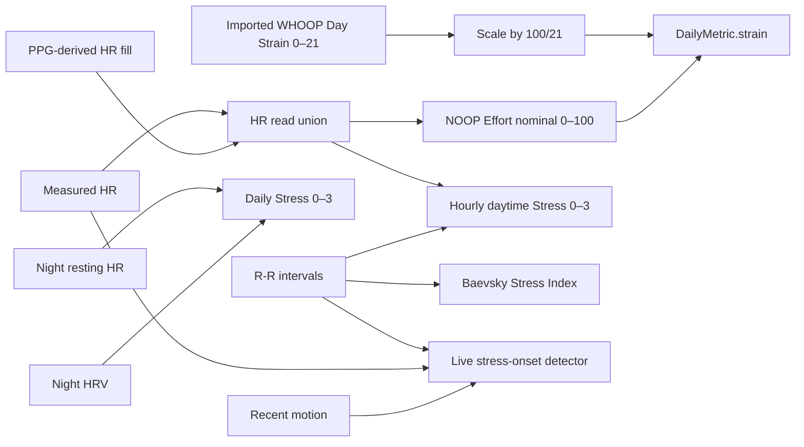

# Stress and Effort: Algorithm and Data Audit

**Status:** Analysis complete. Algorithm changes remain unapproved pending data validation.

**Scope:** Android-maintained NOOP path, with the `whoop-rs` scoring implementation checked for parity. No iOS product work is proposed.

**Evidence snapshot:** NOOP working tree based on `f7238c427e2dd880675201acb845b184b880ff8d`; `whoop-rs` at `17c3a6f5f89a7330f4e1eecedcdd63cb2a34d39a`; inspected 2026-07-20. The NOOP tree was dirty. Relevant inspected dirty files were `WhoopBleClient.kt` (`sha256:8e6bca0ae6b3856e623d9bdd93ddd600986f8d943dd460dbae5a2e5aedf10cf3`), `TodayScreen.kt` (`sha256:7f9587a432bb4e98f31afe3cdc47b95ce5f04b2951bb2ba5f2442246c15b4763`), and untracked `TodayHero.kt` (`sha256:0e1fd8e5696ab0ed29c0127929194eedf80897b0ea6d05060db35cd04efeb310`). Base commits alone cannot reproduce claims involving those files; hashes anchor the exact inspected contents.

“Source-direct” means read directly from current code or tests. “Inferred” means a consequence of connected source-direct facts that has not been reproduced on hardware. “Modeled” means calculated from those formulas with synthetic inputs. “Unknown” marks an unanswered device or validity question. None establishes physiological validity.

## Executive conclusion

Effort is a transparent HR-only cardiovascular-load score. It reads the calendar day's measured HR plus PPG-derived gap fill, converts every sample into a heart-rate-reserve zone weight, accumulates Edwards TRIMP, then maps the result logarithmically onto a nominal 0–100 scale. Rust and Kotlin match bit-for-bit.

The highest-priority source-direct Effort fault is time integration. The first two HR timestamps define one duration that is applied to every sample. A single early cadence change can therefore materially inflate or suppress the whole day. Existing parity tests preserve this behavior; they do not validate it.

The product also mixes imported WHOOP Day Strain and NOOP Effort in one `strain` field. Imported 0–21 values are multiplied by `100/21`, but their algorithm remains proprietary and different. Equal display units do not make the scores equivalent.

“Stress” is not one algorithm. Android presents four separate constructs:

1. Daily 0–3 Stress from nightly resting HR and HRV against prior days.
2. Hourly 0–3 daytime Stress from mean HR and RMSSD against calm hours in the same day.
3. Baevsky Stress Index from R-R intervals.
4. An opt-in live stress-onset detector with an exercise gate.

These constructs share a name but not inputs, baseline, update cadence, or interpretation. The daily and hourly 0–3 values use the same logistic display curve, but they do not measure against the same baseline. The daytime model has no exercise gate, so cardiovascular Effort can be displayed as “Stress.”

Current safe policy:

- Treat Effort as approximate cardiovascular load only.
- Remove claims that movement currently raises Effort.
- Never describe scaled WHOOP Strain as algorithmically equivalent to NOOP Effort.
- Treat daily, daytime, Baevsky, and onset Stress as separate metrics.
- Fix data ordering, source selection, and refresh behavior before calibrating constants.
- Do not tune against WHOOP as a hidden target. Use imported WHOOP values only as an agreement reference.

## System map



The convergence points are presentation and storage, not shared physiological models.

## Effort: current data path

### Stored daily Effort

1. `IntelligenceEngine.analyzeRecent` resolves one device owner per day.
2. It reads a full local calendar day of HR through `WhoopRepository.hrSamples`.
3. The DAO returns measured `hrSample` rows plus `ppgHrSample` rows only where measured HR is absent at that second.
4. `AnalyticsEngine.analyzeDay` supplies that `dayHr` to `RustScores.strain`.
5. FFI calls `physio-algo/src/strain.rs`.
6. The computed value is stored as `DailyMetric.strain` under the computed `"<deviceId>-noop"` source.
7. Imported daily values win the field-level merge where present.

The engine's initial “worth scoring” gate uses at least 200 HR rows from its wider night window. Effort itself uses the separate full-day series and its own 600-dense-or-20-sparse gate.

### Today “live” Effort

`TodayScreen` reads HR from local midnight through now with `hrSamplesUnion(activeStrapId, ...)`. That union covers the active strap and canonical `my-whoop` source, then calls the Kotlin `StrainScorer` with the same nominal configuration.

`TodayHero` displays the greater of live and stored values. This prevents the gauge falling, but it can also make an imported or stale stored value the floor beneath a differently-derived live value.

The read is not continuously reactive. Its `LaunchedEffect` keys are daily metrics and day selection. New raw HR alone does not update the `days` flow, so the value can remain stale until a rescore, day change, or screen remount.

### Workout Effort

Manual workouts first score from smoothed live HR. Sparse WHOOP 5/MG live HR can produce no score or an underpowered score. After offload, `IntelligenceEngine.rescoreManualWorkouts` reads the denser stored window and replaces only genuinely improved values.

Workout Effort is descriptive. It is not added on top of daily Effort; the daily score already integrates the day's raw HR.

## Effort: exact algorithm

Given heart rate `HR`, resting heart rate `RHR`, and maximum heart rate `HRmax`:

```text
HR reserve = HRmax - RHR
%HRR = clamp((HR - RHR) / HR reserve × 100, 0, 100)
```

Default Edwards weights:

| %HRR | Weight |
|---:|---:|
| under 50 | 0 |
| 50–59.99 | 1 |
| 60–69.99 | 2 |
| 70–79.99 | 3 |
| 80–89.99 | 4 |
| 90–100 | 5 |

```text
sample duration = abs(second timestamp - first timestamp) / 60
TRIMP = sum(zone weight for every sample) × sample duration
Effort = 100 × ln(TRIMP + 1) / ln(7201)
```

The result is rounded to two decimals. The denominator `7201` makes 24 hours at weight 5 equal 100 because `5 × 1440 = 7200`. Despite the nominal 0–100 description, the implementation does not clamp its upper bound. TRIMP above 7200 returns Effort above 100.

Inputs and fallbacks:

| Input | Current behavior |
|---|---|
| HRmax override | Used when present. |
| HRmax without override | Tanaka: `208 - 0.7 × age`. |
| Missing usable profile path | Scorer fallback: `220 - default age`. |
| Resting HR | Nightly daily value; otherwise 60 bpm. |
| Dense gate | At least 600 samples. |
| Sparse gate | At least 20 samples spanning at least 600 seconds. |
| Default method | Edwards. |
| Alternate method | Banister, with sex-specific coefficient. |

`estimateHRmax` and `fitStrainDenominator` exist, but the normal daily store path does not fit a personal denominator or derive HRmax from observed peaks.

## Effort: confirmed strengths

| Confidence | Finding |
|---|---|
| Source-direct | Formula is deterministic, inspectable, and offline. |
| Source-direct | Rust and Kotlin use the same gates, weights, duration rule, denominator, and rounding. |
| Source-direct | Parity tests cover dense data, sparse 30-second cadence, null/zero behavior, Banister branches, and optional local WHOOP 5 fixtures. |
| Source-direct | Measured HR wins over PPG-derived HR at equal seconds. |
| Source-direct | Active-strap union exists for Today live Effort. |
| Source-direct | Sparse manual workouts can be rescored after denser historical HR arrives. |
| Source-direct | Imported WHOOP 0–21 strain is rescaled consistently on import and down-converted on export. |

Parity proves both implementations answer identically. It does not prove the answer matches external load, user experience, or a laboratory reference.

## Effort: what is wrong

### 1. One timestamp interval controls the whole day

`sampleDurationMinutes` reads only the first two timestamps. Every later sample receives that duration. There is no per-interval integration, median-cadence estimate, gap cap, or discontinuity handling.

Modeled constant-zone example, 600 samples at weight 3:

| Sequence | Current represented duration | Timestamp-derived duration | Current Effort | Interval-derived Effort |
|---|---:|---:|---:|---:|
| First gap 30 s, remaining gaps 1 s | 300.0 min | 10.47 min | 76.60 | 39.16 |
| First gap 1 s, remaining gaps 30 s | 10.0 min | 299.02 min | 38.66 | 76.56 |

The first case inflates duration by about `28.7×`. The second undercounts by about `29.9×`. These are modeled edge cases, not measured user days, but mixed live/offload/PPG cadence makes the failure mode plausible.

### 2. Output can exceed 100

`trimpToStrain` returns the logarithmic result without a final clamp. Modeled values: TRIMP 9,000 returns `102.51`; TRIMP 14,400 returns `107.80`. The cadence defect can manufacture much larger TRIMP values, so overflow is not only a theoretical extreme.

Research must decide whether values above 100 are legitimate, invalid-input indicators, or display-breaking errors. A silent clamp would hide bad integration, so cadence must be corrected and overflow measured before adopting a clamp policy.

### 3. Mixed algorithms share one stored field

The `strain` column can hold:

- NOOP Edwards-TRIMP Effort;
- imported WHOOP Day Strain multiplied by `100/21`;
- per-workout imported or computed strain values.

Scaling aligns endpoints only. It does not align the curve, source data, recovery interaction, activity detection, or proprietary model behavior. `max(live, stored)` further combines these semantics in one hero value.

### 4. Movement floor is documented but absent

The approved scoring design and `docs/ANALYTICS.md` say steps or active energy raise low-cardio Effort. Current `AnalyticsEngine` passes HR, profile, and resting HR into the scorer. No steps, gravity, calories, or movement-derived floor affects daily Effort.

Current UI wording—“how hard did your heart work”—matches implementation. Older “cardiovascular + movement load” wording does not.

### 5. “Live” refresh misses raw data and source changes

Raw HR arrival does not directly invalidate Today live Effort. The displayed value can freeze between analytics passes while the user remains on the screen.

The read uses `activeStrapId`, but that value is absent from the `LaunchedEffect` keys. Changing the active strap can therefore retain the previous source's live Effort until another key changes or the screen remounts.

### 6. Confidence uses the wrong HR count

Effort consumes `(dayHr ?: hr)`, but `AnalyticsEngine` calls `ScoreConfidence.forEffort(strain, hr.size)`. The confidence label therefore counts the night/wide-window input instead of the calendar-day series that created the score.

The confidence value remains in transient `DayResult`; it is not persisted on `DailyMetric`, and no current UI consumer was located. Documentation promises a surfaced Solid/Building/Calibrating tier that Effort users do not receive.

For a native 30-second stream, a complete day yields about 2,880 samples. The 3,600-sample Solid threshold is unreachable unless 1 Hz measured or PPG-derived rows fill the day. Counting another window can hide that distinction.

### 7. Denominator is theoretical, not validated

`7201` is a constructed 24-hour ceiling. It has not been shown to produce perceptually useful day-to-day spacing across current WHOOP 4, WHOOP 5, and MG data. The calibration helper is unused.

### 8. Hydration uses stored Effort only

Today comments describe a live Effort hydration bump. The actual goal call reads `displayMetric?.strain` before `liveTodayStrain` exists. Hydration can therefore lag the hero.

## Stress: four separate constructs

| Surface | Inputs | Baseline | Output | Refresh/source |
|---|---|---|---|---|
| Daily Stress hero/trend | Daily resting HR, daily HRV, optional stored series | Up to 30 prior daily rows | 0–3 | `recentDays`; stored `my-whoop` read once |
| Daytime timeline | Hourly mean HR, hourly RMSSD | Calm quartiles within current day | 0–3 hourly | `my-whoop` HR/R-R read once |
| Advanced Stress Index | R-R intervals | Baevsky histogram | Raw SI plus components | Same one-shot R-R read |
| Live onset nudge | Rolling R-R, HR, recent motion | Detector thresholds | Event/suppression reason | Live; opt-in; exercise-gated |

The first two reuse the logistic curve and bands. They do not share a physiological baseline. Baevsky SI does not feed either 0–3 score.

## Daily Stress: exact algorithm

The scored day is the newest `DailyMetric` carrying resting HR, HRV, or a stored stress value. It may therefore represent the last analyzed night rather than the current calendar day.

The baseline contains up to 30 earlier rows. For each available signal:

```text
zRHR = (today RHR - baseline mean RHR) / baseline population SD RHR
zHRV = (baseline mean HRV - today HRV) / baseline population SD HRV
raw = available zRHR + available zHRV
Stress = 3 / (1 + exp(-raw))
```

Signals with missing means or standard deviation at or below `0.0001` contribute zero. Bands are:

- Low: 0 to under 1.
- Medium: 1 to under 2.
- High: 2 to 3.

A stored `metricSeries("my-whoop", "stress")` value overrides the derivation for that day.

## Daily Stress: what is wrong

### 1. No trustworthy-baseline gate

There is no minimum prior-day count. With one prior day, population SD is zero, both z terms drop out, `raw=0`, and Stress becomes `1.5` Medium. The UI shows a scored value where the available baseline cannot estimate variance.

Very small non-zero SD has the opposite problem: ordinary changes create extreme z-scores and saturate near 0 or 3. There is no robust spread floor, winsorization, or median/MAD alternative.

### 2. Historical trend is retrospectively renormalized

Every unstored historical point is derived against the currently scored day's single baseline. It does not use the baseline that would have existed on that historical day.

Adding a new day can therefore move old chart points without their source HRV or RHR changing. Stored points are then spliced into that derived line, even if they came from another algorithm.

### 3. Stored Stress has no unified contract

The demo seeder writes a linear score:

```text
clamp(1.5 + 0.6 × zRHR - 0.6 × zHRV, 0, 3)
```

The live daily model uses an unweighted z-sum followed by a logistic. These are not equivalent.

Xiaomi and Garmin importers write brand `avgStress` values under the generic `stress` key without normalizing them to 0–3. Their rows live under `xiaomi-band` or `garmin-import`, while current Stress surfaces hardcode `my-whoop`, so they are normally ignored rather than displayed. This is both a source-routing gap and a latent scale bug if generic source resolution is later added.

The WHOOP CSV importer does not write daily Stress. A code comment claiming demo Stress matches a real WHOOP import is incorrect.

### 4. Stress surfaces disagree

Stress detail and Today can derive daily Stress from RHR/HRV. Trends Report is stored-series only. A user can therefore see Stress on Today while the exported report has no Stress history.

Stored series reads use `LaunchedEffect(Unit)`. Stored-only changes do not guarantee an update until remount. Today caches against a `days` signature, so a metric-series-only update can also remain stale.

### 5. Derived production Stress is transient

Normal WHOOP scoring derives daily Stress in `StressModel` at read time. It does not persist that result into the canonical `my-whoop/stress` series. Demo data does persist a different formula, while Trends Report consumes only persisted rows.

The product needs one explicit contract: persist a versioned derived series, recompute the same model on every surface, or declare daily Stress non-exportable. Current behavior accidentally chooses all three depending on surface and data source.

## Daytime Stress: exact algorithm

The timeline reads today's HR and R-R, groups them into local clock hours, and scores only 06:00 through 21:59.

Each hour requires at least 300 HR rows. Mean HR is always the anchor. RMSSD enriches the hour when sufficient clean R-R exists.

Reference values come from the same day's waking hours:

- calm HR: lower quartile of hourly mean HR;
- calm HRV: upper quartile of hourly RMSSD;
- spread: population SD across waking-hour values.

The raw HR-up and RMSSD-down z terms are passed through the same 0–3 logistic curve. Three trailing scored hours at or above 2 trigger the sustained-high state.

## Daytime Stress: what is wrong

### 1. Exercise is labeled Stress

The timeline has no motion, workout, or HR-zone gate. Exercise raises mean HR and usually lowers short-window HRV, pushing both terms toward High.

The separate `StressOnsetDetector` explicitly suppresses metabolic/exercise conditions using HR and motion. That protection does not apply to the timeline. Until separated, “autonomic load” or “physiological activation” is more accurate than psychological Stress.

### 2. Active-device data can be missed

`loadDaytimeStress` reads HR and R-R only from `my-whoop`. Re-paired straps can write under `whoop-<id>`. Today Effort already uses an active-device union; Stress does not. No equivalent R-R union exists.

### 3. Sparse WHOOP 5 live data misses the hourly gate

A 30-second live cadence yields about 120 HR rows per hour, below the 300-row gate. The current hour can remain blank until denser historical or PPG-derived rows arrive. This makes “daytime” partly an after-offload view on Gen5.

### 4. Sustained hours need not be consecutive

The algorithm walks backward through scored points only. Missing unscored hours disappear before the check. High scores at 10:00, 12:00, and 15:00 can count as three sustained high hours if no scored low hour occurs between them.

### 5. Fixed waking hours are not user-aware

06:00–22:00 ignores shift work, travel, naps, and an individual's actual sleep schedule. It can exclude valid waking load or include sleep.

### 6. One-shot loading goes stale

HR, R-R, Baevsky SI, and frequency-domain HRV load once when the screen mounts. New live or offloaded data does not refresh the open screen.

### 7. “Same score” wording overclaims

Code and UI comments call daytime Stress the same daily proxy at a finer grain. It shares only the 0–3 squash and directional HR/HRV terms. Daily Stress compares night metrics with prior days; daytime Stress compares hourly metrics with calm portions of the same day.

## R-R data integrity risk

Room reads R-R rows in this order:

```text
timestamp ASC, rrMs ASC, seq ASC
```

`assignRrSeq` only distinguishes equal `(timestamp, rrMs)` duplicates. Distinct R-R intervals recorded within the same whole second are sorted by interval magnitude, not original beat order.

RMSSD depends on successive-beat order. Reordering same-second intervals can affect:

- nightly HRV feeding Charge and daily Stress;
- hourly RMSSD feeding daytime Stress;

The live stress-onset detector is not exposed to this Room query: it consumes the in-memory `WhoopBleClient.rrRecent` buffer in notification order. Baevsky's histogram is largely order-independent, although upstream cleaning can still depend on sequence. Existing v18 work fixed loss of equal duplicates, not preservation of complete physiological order.

This is a data-model question, not a constant-tuning question. Preserve beat order before interpreting model agreement.

## Gen5/MG-specific risk

Severity describes possible impact. Evidence labels describe support; likelihood remains unmeasured without the fixture matrix below.

### High, inferred: cadence-dependent Effort error

Current Android paths can combine sparse live HR, denser offloaded HR, and 1 Hz PPG-derived fill. If the first two sorted rows represent a different cadence from the rest, the whole day's TRIMP inherits the wrong duration. Mixed cadence on a real full day remains to be measured.

### High, inferred: score availability changes after offload

Live Effort and daytime Stress can be absent or low-confidence, then materially change once historical or PPG-derived rows arrive. The UI does not clearly distinguish provisional live coverage from post-offload coverage.

### High, source-direct plus single-hardware evidence: clock/history failures remove algorithm inputs

The separate Gen5 clock gap can stop history banking while live HR continues. Effort, nightly HRV, daily Stress, and daytime R-R enrichment then become missing or stale even though the strap appears connected.

### Medium, source-direct: PPG-derived HR changes provenance

PPG-derived rows fill missing measured seconds and can make an otherwise sparse day scorable. Current score persistence does not retain measured-versus-derived contribution, coverage, or quality. Two identical Effort values can therefore have different evidence quality.

### Medium, source-direct: R-R-dependent Stress degrades to HR-only

Daytime Stress still scores when R-R is absent. It then becomes an HR-only activation score while retaining the same 0–3 label and bands.

### Unknown: model equivalence across hardware

No current evidence demonstrates equal HR cadence, PPG accuracy, R-R coverage, or motion availability across WHOOP 4, WHOOP 5, and MG. Algorithm parity across code does not establish device parity across inputs.

## Required research

### Stage 1: data provenance fixtures

For each supported Android device family, archive representative full days containing:

- measured HR timestamps;
- PPG-derived HR timestamps and confidence;
- R-R intervals in decoded arrival order;
- gravity, steps, workouts, sleep, and wrist state;
- active source ID and stored source ID;
- live-versus-historical origin where available;
- firmware, app commit, timezone, and clock state;
- source hashes and redacted capture metadata.

Include calm days, long walks, interval workouts, mixed-cadence reconnects, missing-history days, and days spanning travel or daylight-saving changes.

### Stage 2: fix Effort integration experimentally

Recompute every fixture with:

1. current first-gap duration;
2. per-interval duration;
3. per-interval duration capped at an evidence-backed dropout threshold;
4. median-cadence duration as a diagnostic only.

Report score deltas by device family, measured/PPG ratio, cadence distribution, gap size, and activity type. Do not select a cap before inspecting real gap distributions.

Record how often current and candidate integrations exceed 100. Decide the overflow contract only after distinguishing valid extreme load from corrupted duration.

Add synthetic tests for:

- first-gap outlier;
- cadence transition;
- long data dropout;
- duplicate timestamps;
- unsorted input;
- mixed measured and PPG rows;
- sparse 30-second streams;
- day-boundary truncation.

### Stage 3: validate Effort meaning

Compare NOOP outputs with transparent references:

- independently calculated Edwards TRIMP;
- Banister TRIMP where profile inputs permit;
- session duration and time-in-zone;
- user-rated session exertion;
- imported WHOOP Strain as an agreement reference, never ground truth.

Measure repeatability and sensitivity to HRmax, resting-HR fallback, missing data, and PPG substitution. Decide whether Effort remains cardiovascular-only. If movement enrichment is retained as a goal, specify a separate formula and validate walking/cycling/strength cases before implementation.

### Stage 4: establish one Stress contract

Define separate product names and contracts for:

- nightly baseline deviation;
- intraday physiological activation;
- Baevsky Stress Index;
- live resting stress-onset nudge;
- external brand stress reference values.

Each contract needs inputs, units, minimum evidence, source provenance, update timing, and missing-data behavior.

Decide the production daily-series policy explicitly:

- persist a versioned derived Stress value and its model/provenance;
- derive the identical rolling model on every surface, including reports;
- or keep the value transient and clearly exclude it from stored-history promises.

Do not continue with demo-only persistence and stored-only reporting.

### Stage 5: validate daily Stress

Use at least 30–60 days per participant where possible. Collect simple user check-ins alongside illness, alcohol, travel, hard training, and calm recovery days. This validates a wellness proxy, not diagnosis.

Research:

- minimum baseline days;
- rolling historical baselines;
- robust spread using MAD or a defensible SD floor;
- z-score clipping before logistic squash;
- separate handling for one missing signal;
- model stability when a new day arrives;
- whether RHR and HRV require equal or learned weights.

### Stage 6: validate daytime Stress

Label known workouts and motion periods. Compare scores with and without an exercise gate. Test actual sleep schedules instead of fixed waking hours. Require timestamp adjacency for sustained-high detection.

Stratify results by:

- live versus offloaded data;
- measured versus PPG-derived HR;
- R-R present versus HR-only;
- WHOOP 4 versus WHOOP 5 versus MG;
- active source ID versus canonical import source.

### Stage 7: preserve R-R order

Trace beat ordering from decode through FFI, repository batches, Room primary key, and query. Add a stable sequence representing original physiological order, including distinct beats sharing a second and batches crossing flush boundaries.

Recompute nightly and hourly RMSSD before and after the schema correction. Treat resulting Stress and Charge shifts as a data correction, not model drift.

## Implementation order after research

1. Preserve full R-R beat order.
2. Make Stress reads active-device aware.
3. Make live/daytime values react to new raw data.
4. Replace Effort's first-gap duration with validated interval integration.
5. Choose one production Stress persistence/recomputation contract.
6. Persist score provenance and coverage quality.
7. Correct Effort confidence input and surface it.
8. Separate imported WHOOP Strain from computed NOOP Effort semantically.
9. Split Stress constructs in labels and documentation.
10. Add a baseline gate and robust spread only after fixture analysis.
11. Decide movement enrichment explicitly; implement or remove every claim.

## Acceptance criteria

### Effort

- Irregular cadence cannot let one interval control every sample.
- Gaps and cadence changes have fixture-backed behavior.
- Values above 100 have an explicit, fixture-backed validity and display policy.
- Today updates when relevant raw HR arrives or the active strap changes.
- Confidence counts the exact series used to score.
- Measured and PPG-derived coverage is observable.
- Imported WHOOP values retain distinct provenance.
- Movement claims match implemented inputs.
- Kotlin reference and Rust remain parity-tested during transition.

### Stress

- Daily Stress refuses to score without a defensible baseline.
- Historical daily points use time-correct rolling baselines or are explicitly labeled retrospective.
- Daytime Stress distinguishes exercise/metabolic activation.
- Sustained-high hours are truly adjacent.
- Active strap and canonical data sources are resolved consistently.
- Open screens refresh after new HR/R-R persistence.
- Daily Stress follows one production persistence/recomputation contract on Today, detail, trends, and exports.
- External brand scales never enter the 0–3 series unnormalized.
- R-R order is preserved end-to-end.
- Baevsky SI is never described as the stored/display 0–3 score.

### Gen5/MG

- Validation includes separate WHOOP 5 and MG fixtures.
- Sparse live and denser offload states have explicit UI semantics.
- Score changes after offload are measured and bounded.
- Clock/history loss produces a visible data-quality state rather than silently stale scores.

## Evidence map

| Area | Primary files |
|---|---|
| Kotlin Effort reference | `android/app/src/main/java/com/noop/analytics/StrainScorer.kt` |
| Rust Effort implementation | `../whoop-rs/crates/physio-algo/src/strain.rs` |
| Daily orchestration | `android/app/src/main/java/com/noop/analytics/AnalyticsEngine.kt` |
| Persistence/rescore | `android/app/src/main/java/com/noop/analytics/IntelligenceEngine.kt` |
| HR/PPG union and R-R order | `android/app/src/main/java/com/noop/data/WhoopDao.kt`, `WhoopRepository.kt` |
| Today live Effort | `android/app/src/main/java/com/noop/ui/TodayScreen.kt`, `TodayHero.kt` |
| Confidence | `android/app/src/main/java/com/noop/analytics/ScoreConfidence.kt` |
| WHOOP import/export | `android/app/src/main/java/com/noop/ingest/WhoopCsvImporter.kt`, `WhoopCsvExporter.kt` |
| Daily Stress | `android/app/src/main/java/com/noop/ui/StressScreen.kt` |
| Daytime Stress | `android/app/src/main/java/com/noop/analytics/DaytimeStress.kt` |
| Live onset detector | `android/app/src/main/java/com/noop/analytics/StressOnsetDetector.kt` |
| Baevsky SI | `android/app/src/main/java/com/noop/analytics/StressIndex.kt`, `RustScores.kt` |
| External stress imports | `android/app/src/main/java/com/noop/ingest/XiaomiBandImporter.kt`, `WearableExportImporter.kt` |
| Report behavior | `android/app/src/main/java/com/noop/ui/TrendsReport.kt` |
| Existing parity/behavior tests | `RustStrainParityTest.kt`, `RustStressParityTest.kt`, `StressModelTest.kt`, `DaytimeStressTest.kt`, `StressOnsetDetectorTest.kt` |
| Product documentation | `docs/ANALYTICS.md`, `docs/superpowers/specs/2026-06-12-charge-effort-rest-scoring-design.md` |

## Test gaps identified

No current test located covers all of these high-risk cases:

- irregular Effort cadence;
- Effort overflow above 100;
- mixed measured/PPG cadence;
- live Effort refresh after raw-only persistence;
- live Effort invalidation after active-strap change;
- Effort confidence using `dayHr` count;
- daily Stress baseline minimum;
- daily Stress tiny-SD saturation;
- rolling historical Stress stability;
- mixed stored/derived Stress formulas;
- production derived-Stress persistence and cross-surface equivalence;
- active-device daytime Stress routing;
- missing-hour adjacency for sustained Stress;
- exercise confounding in daytime Stress;
- WHOOP 5 sparse hourly coverage;
- stored-series-only refresh;
- distinct same-second R-R beat ordering.

These gaps should become regression tests alongside each approved correction, not one large rewrite.
